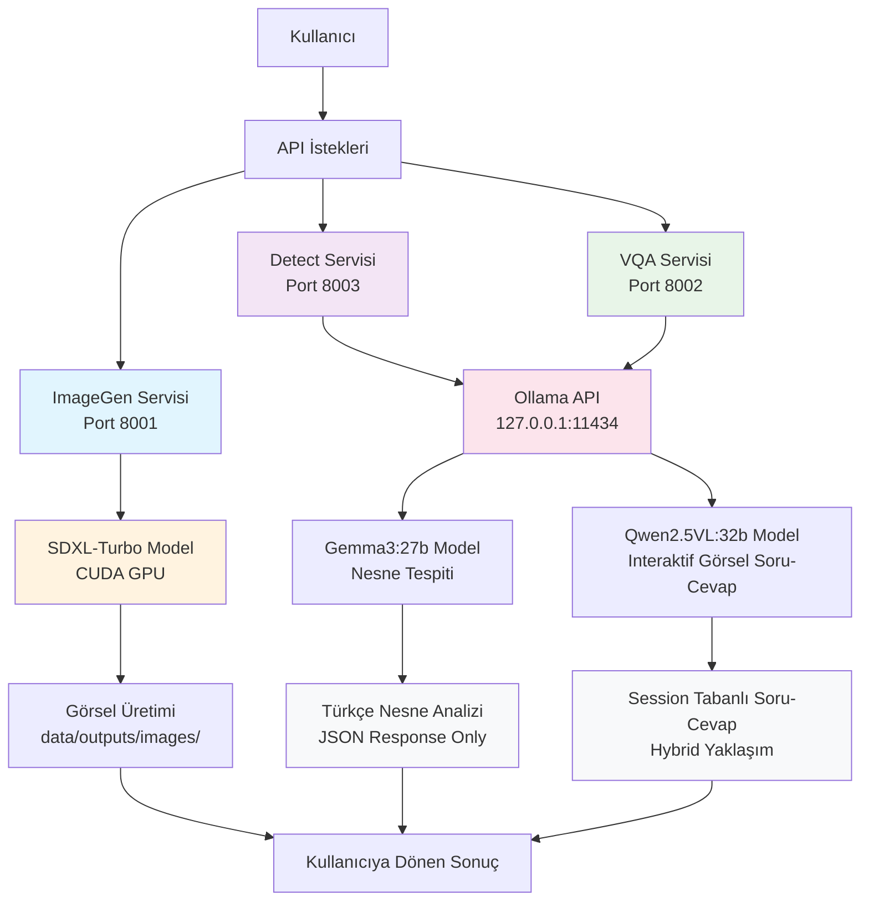
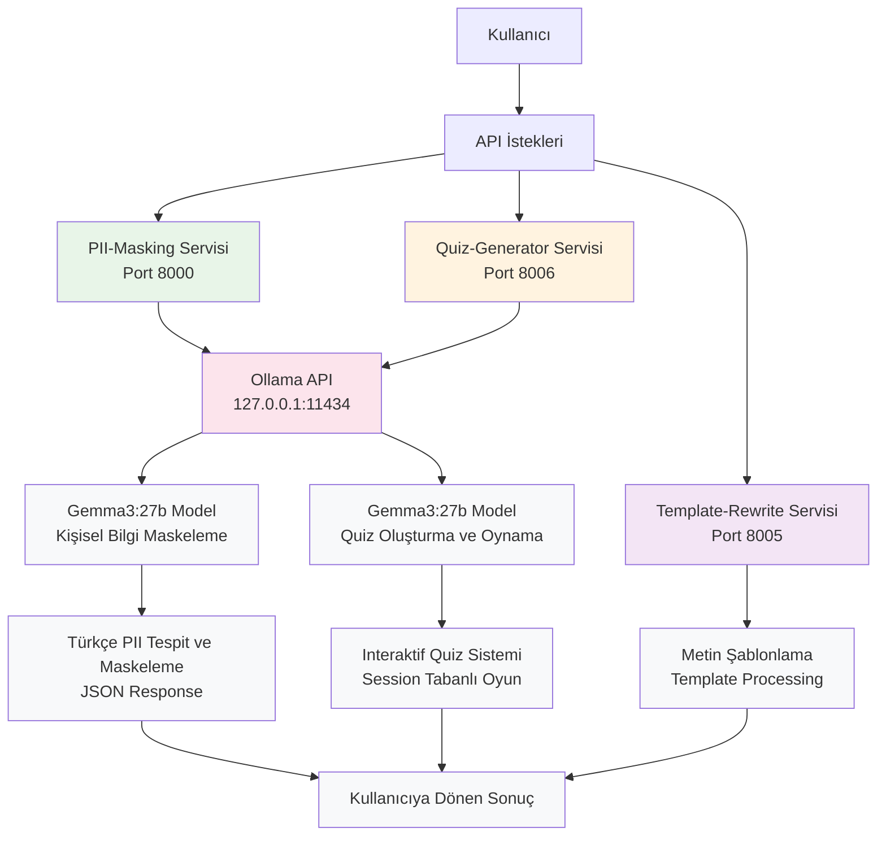

# AI Hub Services

Bu proje, görsel üretim, nesne tespiti ve görselden soru-cevap servislerini içeren bir AI hub'ıdır.

## 🚀 Servisler

### 🎨 Görsel Servisleri
- **imggen** (Port 8001): SDXL-Turbo ile görsel üretim (GPU hızlandırmalı, offline capable)
- **detect** (Port 8003): Gemma3:27b ile nesne tespiti (Ollama üzerinden)
- **vqa** (Port 8002): Qwen2.5VL:32b ile interaktif görselden soru-cevap (Ollama üzerinden)

### 📝 Metin Servisleri
- **pii-masking** (Port 8000): Gemma3:27b ile kişisel bilgi maskeleme (Ollama üzerinden)
- **quiz-generator** (Port 8006): Gemma3:27b ile interaktif quiz oluşturma ve oynama (Ollama üzerinden)
- **template-rewrite** (Port 8005): Word şablonları ile gerekçe belgesi oluşturma (Ollama üzerinden)

## 🖥️ Sistem Gereksinimleri

### Donanım
- **GPU**: NVIDIA GPU (CUDA 12.1+ destekli) - ImageGen servisi için
- **RAM**: En az 16GB (Ollama modelleri için)
- **Disk**: En az 50GB boş alan (modeller için)

### Yazılım
- **Docker**: 20.10+
- **Docker Compose**: 2.0+
- **NVIDIA Container Toolkit**: GPU desteği için
- **Ollama**: 0.1.0+ (host sistemde)
- **CUDA**: 12.1+ (GPU için)

## ⚠️ Önemli Notlar

### Ollama Yönetimi
- **Kritik**: Ollama servisi bazen yeniden başlatılması gerekebilir
- Detect servisi timeout verirse: `sudo systemctl restart ollama`
- Ollama host'ta çalışmalı (127.0.0.1:11434)
- Container'lar `network_mode: "host"` kullanır

### GPU Kullanımı
- **imggen**: CUDA GPU hızlandırması kullanır
- **detect**: Ollama üzerinden çalışır (GPU opsiyonel)
- **vqa**: Ollama üzerinden çalışır (GPU opsiyonel)

## 🛠️ Kurulum

### 1. Ollama Kurulumu (Host)
```bash
# Ollama'yı host'ta kur ve çalıştır
curl -fsSL https://ollama.ai/install.sh | sh
sudo systemctl enable ollama
sudo systemctl start ollama

# Gerekli modelleri indir
ollama pull gemma3:27b    # Detect servisi için
ollama pull qwen2.5vl:32b # VQA servisi için
```

### 2. NVIDIA Docker Kurulumu
```bash
# NVIDIA Container Toolkit kur
distribution=$(. /etc/os-release;echo $ID$VERSION_ID)
curl -s -L https://nvidia.github.io/nvidia-docker/gpgkey | sudo apt-key add -
curl -s -L https://nvidia.github.io/nvidia-docker/$distribution/nvidia-docker.list | sudo tee /etc/apt/sources.list.d/nvidia-docker.list

sudo apt-get update
sudo apt-get install -y nvidia-docker2
sudo systemctl restart docker
```

### 3. Proje Kurulumu
```bash
# Projeyi klonla
git clone <repository-url>
cd ai_hub

# Gerekli dizinleri oluştur
mkdir -p uploads outputs

# Servisleri başlat
docker-compose up --build -d
```

## 📁 Dizin Yapısı

```
ai_hub/
├── services/
│   ├── image/           # Görsel işleme servisleri
│   │   ├── imggen/      # Görsel üretim servisi (GPU gerekli)
│   │   ├── detect/      # Nesne tespiti servisi (Ollama üzerinden)
│   │   └── vqa/         # VQA servisi (Ollama üzerinden)
│   └── text/            # Metin işleme servisleri (gelecekte eklenecek)
├── data/                # Merkezi veri yönetimi
│   ├── uploads/         # Yüklenen dosyalar
│   │   ├── images/      # Görsel dosyalar
│   │   └── documents/   # Metin dosyaları
│   └── outputs/         # Üretilen çıktılar
│       ├── images/      # Üretilen görseller
│       ├── summaries/   # Özetler
│       └── translations/# Çeviriler
├── frontend/            # Web arayüzü
├── docker-compose.yml   # Servis konfigürasyonu
└── README.md            
```

## 🔧 API Kullanımı

### Görsel Üretim (imggen)
```bash
curl -X POST http://localhost:8001/generate \
  -H "Content-Type: application/json" \
  -d '{"prompt": "a beautiful sunset over mountains"}'
```

### Nesne Tespiti (detect)
```bash
curl -X POST http://localhost:8003/detect \
  -F "image=@data/uploads/images/deneme2.jpg" \
  -F "confidence=0.3" \
  -F "max_objects=15"
```

**Çıktı örneği:**
```json
{
  "status": "success",
  "model": "gemma3:27b",
  "total_objects": 10,
  "objects": [
    {
      "name": "araba",
      "confidence": 95,
      "location": "Center",
      "description": "A silver SUV with the trunk open, parked on a grassy hill."
    },
    {
      "name": "erkek",
      "confidence": 90,
      "location": "Left-Center",
      "description": "A man oturuyor at the edge of the open car trunk, giyiyor a jacket and boots."
    }
  ]
}
```

### Interaktif Görselden Soru-Cevap (vqa)
```bash
# 1. Görsel yükle ve session oluştur
curl -X POST http://localhost:8002/upload \
  -F "image=@data/uploads/images/deneme2.jpg"

# 2. Session ID ile soru sor
curl -X POST http://localhost:8002/ask \
  -F "question=Bu görselde ne görüyorsun?" \
  -F "session_id=YOUR_SESSION_ID"

# 3. Session durumunu kontrol et
curl "http://localhost:8002/status?session_id=YOUR_SESSION_ID"

# 4. Konuşma geçmişini gör
curl "http://localhost:8002/history?session_id=YOUR_SESSION_ID"

# 5. Session'ı temizle
curl -X POST http://localhost:8002/clear \
  -F "session_id=YOUR_SESSION_ID"
```

**Özellikler:**
- ✅ **Hybrid Yaklaşım**: Görsel bir kez yüklenir, peş peşe sorular sorulabilir
- ✅ **Session Yönetimi**: Dosya tabanlı session sistemi
- ✅ **Konuşma Geçmişi**: Tüm soru-cevaplar saklanır
- ✅ **Qwen2.5VL:32b**: Gelişmiş görsel anlama modeli

## 🔄 Sistem Akış Diyagramı



### 📝 Text Servisleri Sistem Akışı



## 🐛 Sorun Giderme

### Ollama Timeout Hatası
```bash
# Ollama servisini yeniden başlat
sudo systemctl restart ollama

# Servis durumunu kontrol et
sudo systemctl status ollama

# Modellerin yüklü olduğunu kontrol et
ollama list
```

### GPU Hatası (imggen için)
```bash
# NVIDIA Docker çalışıyor mu kontrol et
docker run --rm --gpus all nvidia/cuda:12.1.1-base-ubuntu22.04 nvidia-smi

# GPU kullanımını kontrol et
nvidia-smi
```

### Port Çakışması
```bash
# Hangi portlar kullanılıyor kontrol et
netstat -tlnp | grep :800

# Container'ları kontrol et
docker ps
```

### Servis Sağlık Kontrolü
```bash
# Tüm servislerin sağlığını kontrol et
curl http://localhost:8001/health  # ImageGen
curl http://localhost:8002/health  # VQA
curl http://localhost:8003/health  # Detect
curl http://localhost:8000/health  # PII Masking
curl http://localhost:8006/health  # Quiz Generator
```

## 📝 Özellikler

- **Türkçe Destek**: Detect, PII-Masking ve Quiz servisleri Türkçe doğal dil işleme yapar
- **GPU Hızlandırma**: ImageGen servisi CUDA GPU kullanır
- **Offline Capability**: ImageGen servisi internet olmadan çalışabilir
- **Modüler Yapı**: Her servis bağımsız olarak çalışabilir
- **Docker Tabanlı**: Kolay kurulum ve dağıtım
- **RESTful API**: Standart HTTP API'ler
- **Merkezi Dosya Yönetimi**: Tüm dosyalar `data/` klasöründe organize edilir
- **Session Yönetimi**: VQA ve Quiz servisleri session tabanlı çalışır
- **Interaktif Oyunlar**: Quiz servisi gerçek zamanlı soru-cevap oyunu sağlar
- **PII Koruma**: Otomatik kişisel bilgi tespit ve maskeleme
- **Word Şablon Desteği**: Mevcut Word dosyalarını şablon olarak kullanma
- **Dinamik Belge Üretimi**: LLM ile akıllı gerekçe belgesi oluşturma

## 🔧 Geliştirme

### Yeni Servis Ekleme
1. `services/image/` veya `services/text/` altında yeni klasör oluştur
2. `Dockerfile` ve `app.py` ekle
3. `docker-compose.yml`'e servis ekle
4. Gerekli portları ayarla
5. `data/uploads/` ve `data/outputs/` altında gerekli klasörleri oluştur

### Log Kontrolü
```bash
# Tüm servislerin loglarını gör
docker-compose logs -f

# Belirli servisin loglarını gör
docker-compose logs -f imggen
docker-compose logs -f detect
docker-compose logs -f vqa
```

## 📊 Performans

- **ImageGen**: ~2-5 saniye (GPU'ya bağlı) - Görsel üretir ve kaydeder
- **Detect**: ~3-8 saniye (Ollama'ya bağlı) - Sadece analiz yapar, dosya kaydetmez
- **VQA**: ~5-15 saniye (Ollama'ya bağlı) - Session tabanlı interaktif soru-cevap

## 🧪 Test Sonuçları

### VQA Servisi (Qwen2.5VL:32b) Test Edildi

**✅ Başarılı Testler:**
- **Aile Fotoğrafı**: 3 kişi, köpek, otomobil detaylarını doğru tespit etti
- **Orman Yangını**: Yangın etkilerini, çevre zararlarını ve çözüm önerilerini analiz etti
- **Müsilaj**: Su kirliliğini tespit etti (spesifik müsilaj tanımı yapamadı)

**🔍 Model Güçlü Yanları:**
- Türkçe cevap verme
- Detaylı görsel analiz
- Çevre sorunlarını tanıma
- Ekosistem etkilerini anlama
- Çözüm önerileri sunma

**⚠️ Model Sınırları:**
- Spesifik çevre sorunlarını (müsilaj gibi) doğrudan tanımlayamama
- Bazı karakterlerde encoding sorunu
- Bazen çok uzun cevaplar

**📈 Genel Değerlendirme:**
Qwen2.5VL:32b modeli genel görsel anlama ve çevre analizi konularında çok başarılı. Interaktif VQA sistemi mükemmel çalışıyor.

### Quiz Generator Servisi (Gemma3:27b) Test Edildi

**✅ Başarılı Testler:**
- **Türkiye Cumhuriyeti Metni**: 3 soruluk quiz başarıyla oluşturuldu
- **Sıfır Atık Metni**: 5 soruluk quiz başarıyla oluşturuldu
- **İnteraktif Oyun**: Soru-cevap döngüsü mükemmel çalışıyor
- **Session Yönetimi**: Quiz ilerlemesi kalıcı olarak saklanıyor

**🎯 Quiz Özellikleri:**
- 4 şıklı çoktan seçmeli sorular
- Türkçe soru ve açıklamalar
- Otomatik doğru/yanlış kontrolü
- Skor takibi ve ilerleme
- Sonraki soru otomatik gösterimi

**📊 API Endpoints:**
- `POST /generate`: Quiz oluşturma
- `POST /answer`: Cevap verme + feedback
- `GET /quiz/{id}`: Quiz durumu kontrolü

**⚙️ Teknik Özellikler:**
- **Model**: Gemma3:27b via Ollama
- **Session**: JSON dosya tabanlı
- **Port**: 8006 (host network)
- **Response Time**: ~15-30 saniye quiz üretimi

**🎮 Örnek Kullanım:**
```bash
# Quiz oluştur
curl -X POST http://localhost:8006/generate \
  -H "Content-Type: application/json" \
  -d '{"text":"Metniniz...", "num_questions":5}'

# Cevap ver
curl -X POST http://localhost:8006/answer \
  -H "Content-Type: application/json" \
  -d '{"quiz_id":"quiz-id", "question_index":0, "user_answer":"A) Seçenek"}'
```

## 🤝 Katkıda Bulunma

1. Fork yap
2. Feature branch oluştur
3. Değişikliklerini commit et
4. Pull request gönder

## 🚀 Gelecek Planları

### Text Servisleri (Yakında)
- **Summarizer**: Metin özetleme servisi
- **Translator**: Çok dilli çeviri servisi  
- **Sentiment**: Duygu analizi servisi
- **NER**: Adlandırılmış varlık tanıma servisi

### Sistem Akış Diyagramı (Text Servisleri)
Text servisleri eklendikten sonra ayrı bir diyagram oluşturulacak.

## 📄 Lisans

Bu proje MIT lisansı altında lisanslanmıştır.