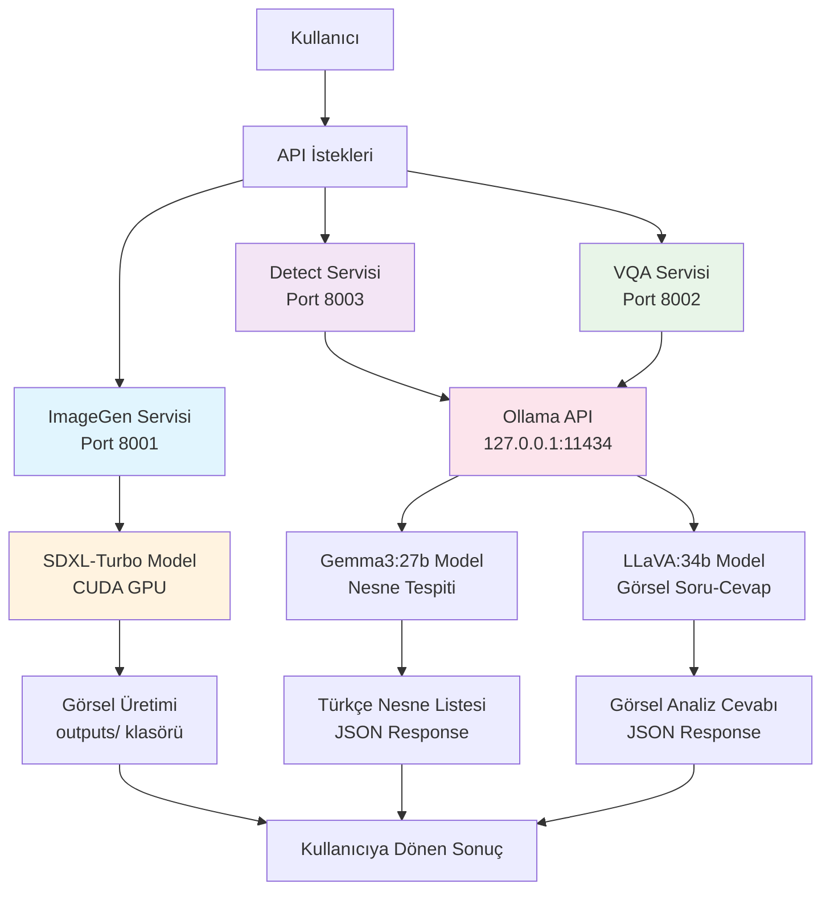

# AI Hub Services

Bu proje, görsel üretim, nesne tespiti ve görselden soru-cevap servislerini içeren bir AI hub'ıdır.

## 🚀 Servisler

- **imggen** (Port 8001): SDXL-Turbo ile görsel üretim (GPU hızlandırmalı)
- **detect** (Port 8003): Gemma3:27b ile nesne tespiti (Ollama üzerinden)
- **vqa** (Port 8002): LLaVA:34b ile görselden soru-cevap (Ollama üzerinden)

## 🖥️ Sistem Gereksinimleri

### Donanım
- **GPU**: NVIDIA GPU (CUDA 12.1+ destekli) - ImageGen servisi için
- **RAM**: En az 16GB (Ollama modelleri için)
- **Disk**: En az 50GB boş alan (modeller için)

### Yazılım
- **Docker**: 20.10+
- **Docker Compose**: 2.0+
- **NVIDIA Container Toolkit**: GPU desteği için
- **Ollama**: 0.1.0+ (host sistemde)
- **CUDA**: 12.1+ (GPU için)

## ⚠️ Önemli Notlar

### Ollama Yönetimi
- **Kritik**: Ollama servisi bazen yeniden başlatılması gerekebilir
- Detect servisi timeout verirse: `sudo systemctl restart ollama`
- Ollama host'ta çalışmalı (127.0.0.1:11434)
- Container'lar `network_mode: "host"` kullanır

### GPU Kullanımı
- **imggen**: CUDA GPU hızlandırması kullanır
- **detect**: Ollama üzerinden çalışır (GPU opsiyonel)
- **vqa**: Ollama üzerinden çalışır (GPU opsiyonel)

## 🛠️ Kurulum

### 1. Ollama Kurulumu (Host)
```bash
# Ollama'yı host'ta kur ve çalıştır
curl -fsSL https://ollama.ai/install.sh | sh
sudo systemctl enable ollama
sudo systemctl start ollama

# Gerekli modelleri indir
ollama pull gemma3:27b    # Detect servisi için
ollama pull llava:34b     # VQA servisi için
```

### 2. NVIDIA Docker Kurulumu
```bash
# NVIDIA Container Toolkit kur
distribution=$(. /etc/os-release;echo $ID$VERSION_ID)
curl -s -L https://nvidia.github.io/nvidia-docker/gpgkey | sudo apt-key add -
curl -s -L https://nvidia.github.io/nvidia-docker/$distribution/nvidia-docker.list | sudo tee /etc/apt/sources.list.d/nvidia-docker.list

sudo apt-get update
sudo apt-get install -y nvidia-docker2
sudo systemctl restart docker
```

### 3. Proje Kurulumu
```bash
# Projeyi klonla
git clone <repository-url>
cd ai_hub

# Gerekli dizinleri oluştur
mkdir -p uploads outputs

# Servisleri başlat
docker-compose up --build -d
```

## 📁 Dizin Yapısı

```
ai_hub/
├── services/
│   ├── imggen/          # Görsel üretim servisi (GPU gerekli)
│   ├── detect/          # Nesne tespiti servisi (Ollama üzerinden)
│   └── vqa/             # VQA servisi (Ollama üzerinden)
├── uploads/             # Yüklenen dosyalar
├── outputs/             # Üretilen çıktılar
├── docker-compose.yml   # Servis konfigürasyonu
└── README.md            
```

## 🔧 API Kullanımı

### Görsel Üretim (imggen)
```bash
curl -X POST http://localhost:8001/generate \
  -H "Content-Type: application/json" \
  -d '{"prompt": "a beautiful sunset over mountains"}'
```

### Nesne Tespiti (detect)
```bash
curl -X POST http://localhost:8003/detect \
  -F "image=@uploads/deneme2.jpg" \
  -F "confidence=0.3" \
  -F "max_objects=15"
```

### Görselden Soru-Cevap (vqa)
```bash
curl -X POST http://localhost:8002/vqa \
  -F "image=@uploads/deneme2.jpg" \
  -F "question=What do you see in this image?"
```

## 🔄 Sistem Akış Diyagramı



## 🐛 Sorun Giderme

### Ollama Timeout Hatası
```bash
# Ollama servisini yeniden başlat
sudo systemctl restart ollama

# Servis durumunu kontrol et
sudo systemctl status ollama

# Modellerin yüklü olduğunu kontrol et
ollama list
```

### GPU Hatası (imggen için)
```bash
# NVIDIA Docker çalışıyor mu kontrol et
docker run --rm --gpus all nvidia/cuda:12.1.1-base-ubuntu22.04 nvidia-smi

# GPU kullanımını kontrol et
nvidia-smi
```

### Port Çakışması
```bash
# Hangi portlar kullanılıyor kontrol et
netstat -tlnp | grep :800

# Container'ları kontrol et
docker ps
```

### Servis Sağlık Kontrolü
```bash
# Tüm servislerin sağlığını kontrol et
curl http://localhost:8001/health  # ImageGen
curl http://localhost:8002/health  # VQA
curl http://localhost:8003/health  # Detect
```

## 📝 Özellikler

- **Türkçe Destek**: Detect servisi Türkçe nesne tespiti yapar
- **GPU Hızlandırma**: ImageGen servisi CUDA GPU kullanır
- **Modüler Yapı**: Her servis bağımsız olarak çalışabilir
- **Docker Tabanlı**: Kolay kurulum ve dağıtım
- **RESTful API**: Standart HTTP API'ler
- **Dosya Yönetimi**: Otomatik upload/output yönetimi

## 🔧 Geliştirme

### Yeni Servis Ekleme
1. `services/` altında yeni klasör oluştur
2. `Dockerfile` ve `app.py` ekle
3. `docker-compose.yml`'e servis ekle
4. Gerekli portları ayarla

### Log Kontrolü
```bash
# Tüm servislerin loglarını gör
docker-compose logs -f

# Belirli servisin loglarını gör
docker-compose logs -f imggen
docker-compose logs -f detect
docker-compose logs -f vqa
```

## 📊 Performans

- **ImageGen**: ~2-5 saniye (GPU'ya bağlı)
- **Detect**: ~3-8 saniye (Ollama'ya bağlı)
- **VQA**: ~5-15 saniye (Ollama'ya bağlı)

## 🤝 Katkıda Bulunma

1. Fork yap
2. Feature branch oluştur
3. Değişikliklerini commit et
4. Pull request gönder

## 📄 Lisans

Bu proje MIT lisansı altında lisanslanmıştır.