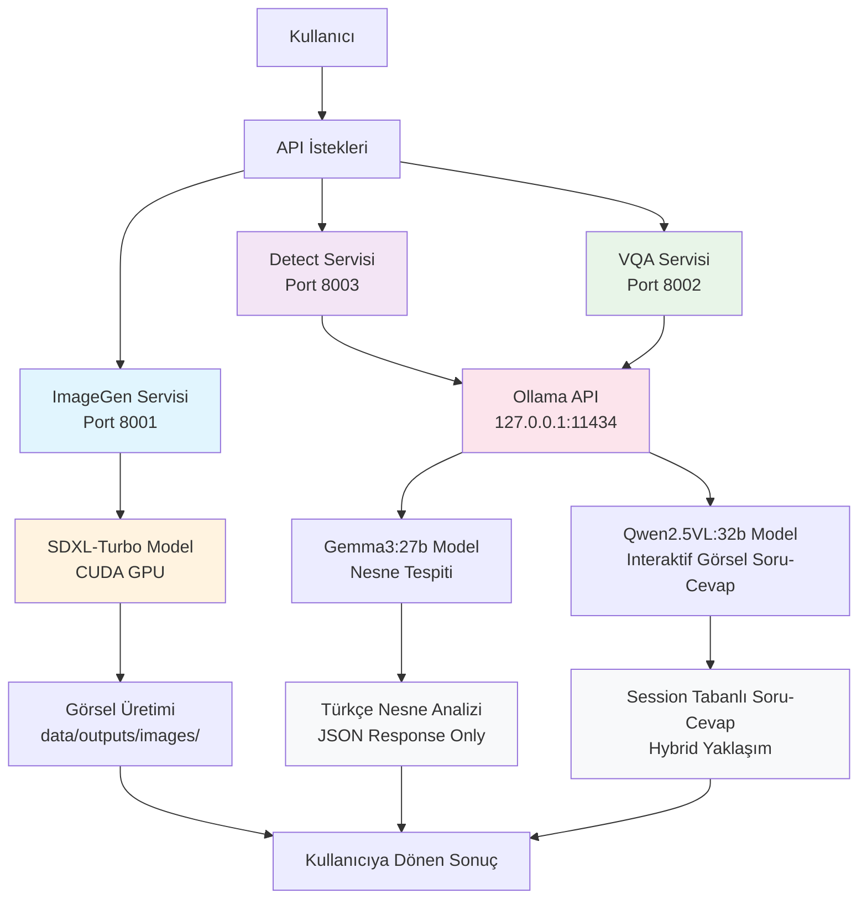
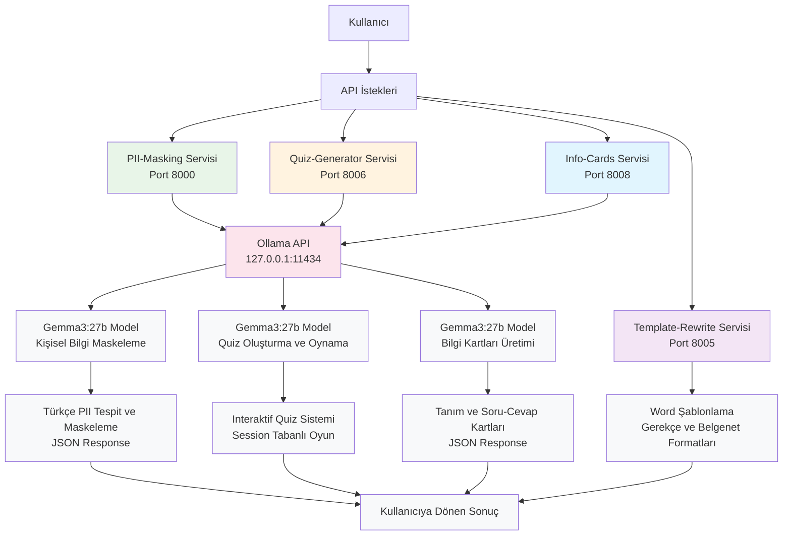
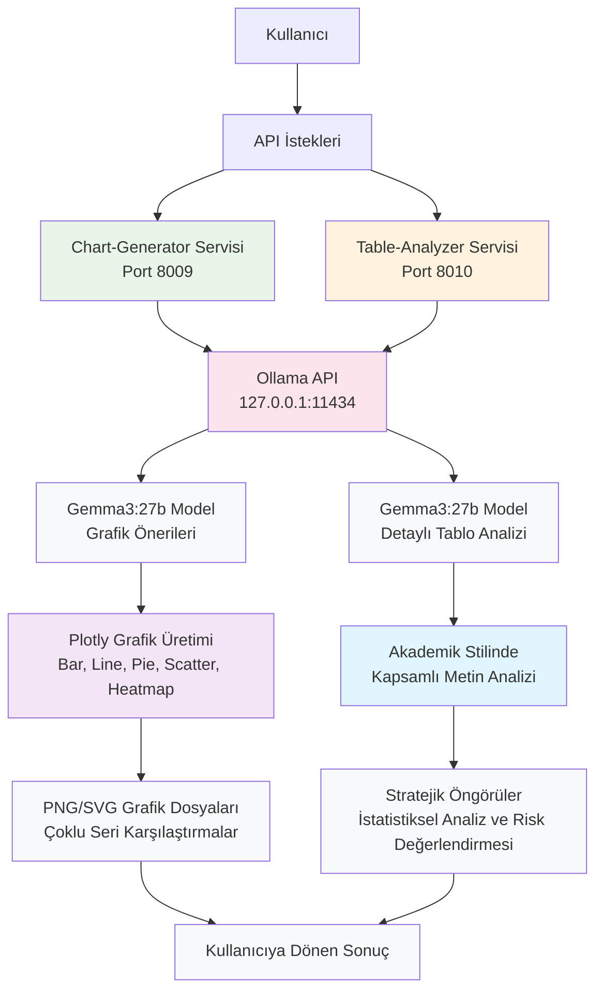

# AI Hub Services

Bu proje, görsel üretim, nesne tespiti, metin işleme ve tablo analizi servislerini içeren kapsamlı bir AI hub'ıdır.

## 🚀 Hızlı Başlangıç

### 1. Gerekli Servisleri Başlat
```bash
# 1. Ollama Proxy'yi başlat (ayrı terminal)
py ollama_proxy.py

# 2. Docker servislerini başlat
docker compose up -d

# 3. Frontend'i başlat (ayrı terminal)
cd frontend
py -m http.server 3000
```

### 2. Test Et
- **Frontend**: http://localhost:3000
- **Detect Servisi**: http://localhost:8003/health
- **Tüm Servisler**: README'deki API örneklerini kullan

### 3. Sorun Giderme
- **500 Hatası**: Ollama proxy'nin çalıştığından emin olun
- **Bağlantı Sorunu**: `curl http://localhost:11434/api/tags` ile test edin
- **Loglar**: `docker compose logs detect -f` ile izleyin

## 📋 Servisler

### 🎨 Görsel Servisleri
- **imggen** (Port 8001): SDXL-Turbo ile görsel üretim (GPU hızlandırmalı, offline capable)
- **detect** (Port 8003): Gemma3:27b ile nesne tespiti (Ollama üzerinden)
- **vqa** (Port 8002): Qwen2.5VL:32b ile interaktif görselden soru-cevap (Ollama üzerinden)

### 📝 Metin Servisleri
- **pii-masking** (Port 8000): Gemma3:27b ile kişisel bilgi maskeleme (Ollama üzerinden)
- **quiz-generator** (Port 8006): Gemma3:27b ile interaktif quiz oluşturma ve oynama (Ollama üzerinden)
- **template-rewrite** (Port 8007): Word şablonları ile belge oluşturma - Gerekçe ve Belgenet formatları (Ollama üzerinden)
- **info-cards** (Port 8008): Gemma3:27b ile metin analizi ve bilgi kartları üretimi (Ollama üzerinden)

### 📊 Tablo İşlemleri
- **chart-generator** (Port 8009): JSON/CSV/Excel tablolardan otomatik grafik üretimi (Ollama üzerinden)
- **table-analyzer** (Port 8010): Tablolardan detaylı metin analizi ve stratejik öngörüler (Ollama üzerinden)

## 🖥️ Sistem Gereksinimleri

### Donanım
- **GPU**: NVIDIA GPU (CUDA 12.1+ destekli) - ImageGen servisi için
- **RAM**: En az 16GB (Ollama modelleri için)
- **Disk**: En az 50GB boş alan (modeller için)

### Yazılım
- **Docker**: 20.10+
- **Docker Compose**: 2.0+
- **NVIDIA Container Toolkit**: GPU desteği için
- **Ollama**: 0.1.0+ (host sistemde)
- **CUDA**: 12.1+ (GPU için)

## ⚠️ Önemli Notlar

### Windows Docker Desktop Kullanımı
Bu proje **Windows Docker Desktop** ortamında çalışmak üzere yapılandırılmıştır:

- **Ollama Proxy Gerekli**: Container'lar external Ollama sunucusuna `ollama_proxy.py` üzerinden bağlanır
- **Host Network Modu**: Windows'ta çalışmadığı için kaldırılmıştır
- **Port Mapping**: Tüm servisler explicit port mapping kullanır
- **Extra Hosts**: Container'lar `host.docker.internal` kullanarak Windows host'a erişir

### Ollama Yönetimi
- **External Ollama**: Dış Ollama sunucusu kullanılır (IP adresi `ollama_proxy.py` dosyasında yapılandırılır)
- **Proxy Başlatma**: `py ollama_proxy.py` (localhost:11434 dinler)
- **Container Erişimi**: Container'lar → `host.docker.internal:11434` → Proxy → External Ollama
- **Model**: `gemma3:27b` kullanılır (external sunucuda yüklü olmalı)
- **⚠️ Önemli**: Proxy URL'de `/api` prefix'i OLMAMALI (çakışma yaratır)

### GPU Kullanımı
- **imggen**: CUDA GPU hızlandırması kullanır (zorunlu)
- **detect**: Ollama üzerinden çalışır (GPU ile performans artışı)
- **vqa**: Ollama üzerinden çalışır (GPU ile performans artışı)
- **pii-masking**: Ollama üzerinden çalışır (GPU ile performans artışı)
- **quiz-generator**: Ollama üzerinden çalışır (GPU ile performans artışı)
- **template-rewrite**: Ollama üzerinden çalışır (GPU ile performans artışı)
- **info-cards**: Ollama üzerinden çalışır (GPU ile performans artışı)
- **chart-generator**: Ollama üzerinden çalışır (GPU ile performans artışı)
- **table-analyzer**: Ollama üzerinden çalışır (GPU ile performans artışı)

## 🛠️ Kurulum (Windows Docker Desktop)

### 1. Ön Gereksinimler
- **Docker Desktop for Windows** kurulu ve çalışır olmalı
- **Python 3.9+** kurulu olmalı (proxy için)
- **Git Bash** önerilir (PowerShell'de encoding sorunları olabilir)
- **External Ollama sunucusu** erişilebilir olmalı (IP adresi `ollama_proxy.py` dosyasında yapılandırılır)

### 2. Proje Kurulumu
```bash
# Projeyi klonla
git clone https://github.com/aeyeniay/ai_hub.git
cd ai_hub

# .env dosyasını yapılandır
# OLLAMA_BASE_URL=http://host.docker.internal:11434
# TEMPLATE_REWRITE_PORT=8007

# Gerekli Python paketlerini kur (proxy için)
pip install flask requests

# Ollama proxy'yi başlat (ayrı terminal)
py ollama_proxy.py

# Docker servisleri başlat
docker compose up -d

# Servislerin durumunu kontrol et
docker compose ps
```

### 3. Test JSON Dosyalarını Oluştur
```bash
# test_belgenet.json
echo '{"konu":"Test Belgenet","icerik_konusu":"Test icerigi","format_type":"belgenet"}' > test_belgenet.json

# test_gerekce.json  
echo '{"konu":"Test Gerekce","icerik_konusu":"Test icerigi","imza_atacaklar":[{"isim":"Test","unvan":"Mudur"}]}' > test_gerekce.json
```

## 📁 Dizin Yapısı

```
ai_hub/
├── services/
│   ├── image/           # Görsel işleme servisleri
│   │   ├── imggen/      # Görsel üretim servisi (GPU gerekli)
│   │   ├── detect/      # Nesne tespiti servisi (Ollama üzerinden)
│   │   └── vqa/         # VQA servisi (Ollama üzerinden)
│   ├── text/            # Metin işleme servisleri
│   │   ├── pii-masking/ # Kişisel bilgi maskeleme
│   │   ├── quiz-generator/ # Quiz oluşturma ve oynama
│   │   ├── template-rewrite/ # Word şablonları ile belge oluşturma
│   │   └── info-cards/  # Bilgi kartları üretimi
│   └── table/           # Tablo işlemleri
│       ├── chart-generator/ # Grafik üretimi
│       └── table-analyzer/  # Tablo analizi
├── data/                # Merkezi veri yönetimi
│   ├── uploads/         # Yüklenen dosyalar
│   │   ├── images/      # Görsel dosyalar
│   │   ├── text/        # Metin dosyaları
│   │   └── table/       # Tablo dosyaları
│   └── outputs/         # Üretilen çıktılar
│       ├── images/      # Üretilen görseller
│       ├── text/        # Metin çıktıları
│       └── table/       # Grafik ve analiz çıktıları
├── models/              # Yerel model dosyaları
├── docker-compose.yml   # Servis konfigürasyonu
├── setup.sh            # Otomatik kurulum scripti
└── README.md            
```

## 🔧 API Kullanımı

### 1. PII Masking (8000) - Kişisel Veri Maskeleme
```bash
curl -X POST http://localhost:8000/mask \
  -H "Content-Type: application/json" \
  -d '{"text":"Benim adim Ahmet Yeniay ve telefon numaram 0532 123 4567"}'
```

### 2. Image Generator (8001) - Görsel Oluşturma
```bash
curl -X POST http://localhost:8001/generate \
  -H "Content-Type: application/json" \
  -d '{"prompt":"a beautiful sunset over mountains"}'
```
> Görseller: `data/outputs/images/`

### 3. VQA (8002) - Görsel Soru Cevaplama
```bash
# Adım 1: Görseli yükle
curl -X POST http://localhost:8002/upload \
  -F "image=@data/uploads/images/deneme3.webp"

# Adım 2: Dönen session_id ile soru sor
curl -X POST http://localhost:8002/ask \
  -F "question=Bu gorselde ne goruyorsun?" \
  -F "session_id=YUKARDAKI_SESSION_ID"
```

### 4. Detect (8003) - Nesne Tespiti (Türkçe)
```bash
curl -X POST http://localhost:8003/detect \
  -F "image=@data/uploads/images/deneme3.webp" \
  -F "confidence=0.3"
```

### 5. Quiz Generator (8006) - Quiz Oluşturma
```bash
curl -X POST http://localhost:8006/generate \
  -H "Content-Type: application/json" \
  -d '{"text":"Turkiye Cumhuriyeti 1923 yilinda kurulmustur. Baskent Ankara secilmistir. Mustafa Kemal Ataturk cumhuriyetin kurucusudur.","num_questions":3,"difficulty":"medium"}'
```

### 6. Template Rewrite (8007) - Belge Oluşturma
**Belgenet:**
```bash
curl -X POST http://localhost:8007/generate-document \
  -H "Content-Type: application/json" \
  -d @test_belgenet.json \
  --max-time 120
```

**Gerekçe:**
```bash
curl -X POST http://localhost:8007/generate-gerekce \
  -H "Content-Type: application/json" \
  -d @test_gerekce.json \
  --max-time 120
```
> Belgeler: `data/outputs/text/`

### 7. Info Cards (8008) - Bilgi Kartları
```bash
curl -X POST http://localhost:8008/generate-cards \
  -H "Content-Type: application/json" \
  -d '{"text":"Yapay zeka nedir? Yapay zeka, bilgisayarlarin insan gibi dusunmesini saglayan bir teknolojidir.","num_cards":5}'
```

### 8. Chart Generator (8009) - Grafik Oluşturma
```bash
curl -X POST http://localhost:8009/generate-charts \
  -H "Content-Type: application/json" \
  -d '{"table_data":[{"ay":"Ocak","satis":65},{"ay":"Subat","satis":59},{"ay":"Mart","satis":80}],"max_charts":3,"output_format":"png"}'
```
> Grafikler: `data/outputs/table/`

### 9. Table Analyzer (8010) - Tablo Analizi
```bash
curl -X POST http://localhost:8010/analyze-table \
  -H "Content-Type: application/json" \
  -d '{"table_data":[{"Urun":"Laptop","Ocak":150,"Subat":180,"Mart":200}],"language":"turkish","output_format":"text"}'
```

### Health Check (Tüm Servisler)
```bash
curl http://localhost:8000/health  # PII Masking
curl http://localhost:8001/health  # Image Generator
curl http://localhost:8002/health  # VQA
curl http://localhost:8003/health  # Detect
curl http://localhost:8006/health  # Quiz Generator
curl http://localhost:8007/health  # Template Rewrite
curl http://localhost:8008/health  # Info Cards
curl http://localhost:8009/health  # Chart Generator
curl http://localhost:8010/health  # Table Analyzer
```

**Özellikler:**
- ✅ **Hybrid Yaklaşım**: Görsel bir kez yüklenir, peş peşe sorular sorulabilir
- ✅ **Session Yönetimi**: Dosya tabanlı session sistemi
- ✅ **Konuşma Geçmişi**: Tüm soru-cevaplar saklanır
- ✅ **Qwen2.5VL:32b**: Gelişmiş görsel anlama modeli

## 🔄 Sistem Akış Diyagramları

### 📝 Görsel Servisleri Sistem Akışı


```mermaid
graph TB
    A[Kullanıcı] --> B[API İstekleri]
    
    B --> C[ImageGen Servisi<br/>Port 8001]
    B --> D[Detect Servisi<br/>Port 8003]
    B --> E[VQA Servisi<br/>Port 8002]
    
    C --> F[SDXL-Turbo Model<br/>CUDA GPU]
    F --> G[Görsel Üretimi<br/>data/outputs/images/]
    
    D --> H[Ollama API<br/>127.0.0.1:11434]
    E --> H
    
    H --> I[Gemma3:27b Model<br/>Nesne Tespiti]
    H --> J[Qwen2.5VL:32b Model<br/>Interaktif Görsel Soru-Cevap]
    
    I --> K[Türkçe Nesne Analizi<br/>JSON Response Only]
    J --> L[Session Tabanlı Soru-Cevap<br/>Hybrid Yaklaşım]
    
    G --> M[Kullanıcıya Dönen Sonuç]
    K --> M
    L --> M
    
    style C fill:#e1f5fe
    style D fill:#f3e5f5
    style E fill:#e8f5e8
    style F fill:#fff3e0
    style H fill:#fce4ec
    style K fill:#f8f9fa
    style L fill:#f8f9fa
```

### 📝 Metin Servisleri Sistem Akışı


```mermaid
graph TB
    A[Kullanıcı] --> B[API İstekleri]
    
    B --> C[PII-Masking Servisi<br/>Port 8000]
    B --> D[Quiz-Generator Servisi<br/>Port 8006]
    B --> E[Template-Rewrite Servisi<br/>Port 8005]
    B --> F[Info-Cards Servisi<br/>Port 8008]
    
    C --> G[Ollama API<br/>127.0.0.1:11434]
    D --> G
    F --> G
    
    G --> H[Gemma3:27b Model<br/>Kişisel Bilgi Maskeleme]
    G --> I[Gemma3:27b Model<br/>Quiz Oluşturma ve Oynama]
    G --> J[Gemma3:27b Model<br/>Bilgi Kartları Üretimi]
    
    H --> K[Türkçe PII Tespit ve Maskeleme<br/>JSON Response]
    I --> L[Interaktif Quiz Sistemi<br/>Session Tabanlı Oyun]
    J --> M[Tanım ve Soru-Cevap Kartları<br/>JSON Response]
    
    E --> N[Word Şablonlama<br/>Gerekçe ve Belgenet Formatları]
    
    K --> O[Kullanıcıya Dönen Sonuç]
    L --> O
    M --> O
    N --> O
    
    style C fill:#e8f5e8
    style D fill:#fff3e0
    style E fill:#f3e5f5
    style F fill:#e1f5fe
    style G fill:#fce4ec
    style H fill:#f8f9fa
    style I fill:#f8f9fa
    style J fill:#f8f9fa
    style K fill:#f8f9fa
    style L fill:#f8f9fa
    style M fill:#f8f9fa
    style N fill:#f8f9fa
    style O fill:#f8f9fa
```

### 📊 Tablo İşlemleri Sistem Akışı


```mermaid
graph TB
    A[Kullanıcı] --> B[API İstekleri]
    
    B --> C[Chart-Generator Servisi<br/>Port 8009]
    B --> D[Table-Analyzer Servisi<br/>Port 8010]
    
    C --> E[Ollama API<br/>127.0.0.1:11434]
    D --> E
    
    E --> F[Gemma3:27b Model<br/>Grafik Önerileri]
    E --> G[Gemma3:27b Model<br/>Detaylı Tablo Analizi]
    
    F --> H[Plotly Grafik Üretimi<br/>Bar, Line, Pie, Scatter, Heatmap]
    G --> I[Akademik Stilinde<br/>Kapsamlı Metin Analizi]
    
    H --> J[PNG/SVG Grafik Dosyaları<br/>Çoklu Seri Karşılaştırmalar]
    I --> K[Stratejik Öngörüler<br/>İstatistiksel Analiz ve Risk Değerlendirmesi]
    
    J --> L[Kullanıcıya Dönen Sonuç]
    K --> L
    
    style C fill:#e8f5e8
    style D fill:#fff3e0
    style E fill:#fce4ec
    style F fill:#f8f9fa
    style G fill:#f8f9fa
    style H fill:#f3e5f5
    style I fill:#e1f5fe
    style J fill:#f8f9fa
    style K fill:#f8f9fa
    style L fill:#f8f9fa
```

## 🐛 Sorun Giderme (Windows)

### Ollama Proxy Çalışmıyor
```bash
# Proxy'nin çalıştığını kontrol et
curl http://localhost:11434/api/tags

# Proxy'yi yeniden başlat
# Ctrl+C ile durdur, sonra:
py ollama_proxy.py

# External Ollama'ya erişimi kontrol et
# (IP adresini ollama_proxy.py dosyasından alın)
curl http://[OLLAMA_IP]/api/tags

# ⚠️ ÖNEMLİ: Proxy URL'de /api prefix'i olmamalı!
# Yanlış: OLLAMA_SERVER = "http://[IP]/api"
# Doğru: OLLAMA_SERVER = "http://[IP]"
```

### Container Ollama'ya Bağlanamıyor
```bash
# Container içinden test et
docker exec ai_hub-detect-1 curl http://host.docker.internal:11434/api/tags

# .env dosyasını kontrol et
cat .env | grep OLLAMA_BASE_URL
# Olması gereken: OLLAMA_BASE_URL=http://host.docker.internal:11434

# Container'ı restart et
docker compose restart detect
```

### Port Çakışması
```bash
# Windows'ta port kullanımını kontrol et
netstat -ano | findstr :8007

# Eğer port 8005 kullanılamıyorsa (PID 4), .env'de değiştir:
# TEMPLATE_REWRITE_PORT=8007
```

### Template Rewrite "Empty Reply" Hatası
```bash
# Port uyuşmazlığı olabilir, rebuild et:
docker compose up -d --build template-rewrite

# Health check yap
curl http://localhost:8007/health
```

### Türkçe Karakter Sorunları (Git Bash)
```bash
# PowerShell yerine Git Bash kullan
# JSON dosyası kullan inline yerine:
curl -X POST http://localhost:8007/generate-document \
  -d @test_belgenet.json
```

### Servis Loglarını Kontrol Et
```bash
# Tüm servislerin loglarını gör
docker compose logs -f

# Belirli servisin loglarını gör
docker compose logs -f template-rewrite
docker compose logs -f detect

# Detect servisi için detaylı hata logları
# Debug modu aktif - hata detayları görüntülenir
docker compose logs detect --tail=50
```

### Servis Sağlık Kontrolü
```bash
# Tüm servislerin sağlığını kontrol et
curl http://localhost:8000/health  # PII Masking
curl http://localhost:8001/health  # ImageGen
curl http://localhost:8002/health  # VQA
curl http://localhost:8003/health  # Detect
curl http://localhost:8006/health  # Quiz Generator
curl http://localhost:8007/health  # Template Rewrite
curl http://localhost:8008/health  # Info Cards
curl http://localhost:8009/health  # Chart Generator
curl http://localhost:8010/health  # Table Analyzer
```

## 📝 Özellikler

- **Windows Docker Desktop Desteği**: Windows ortamında sorunsuz çalışır
- **Proxy Tabanlı Ollama Bağlantısı**: External Ollama sunucusuna proxy üzerinden güvenli bağlantı
- **Türkçe Destek**: Detect, PII-Masking ve Quiz servisleri Türkçe doğal dil işleme yapar
- **GPU Hızlandırma**: ImageGen servisi CUDA GPU kullanır
- **Offline Capability**: ImageGen servisi internet olmadan çalışabilir
- **Modüler Yapı**: Her servis bağımsız olarak çalışabilir
- **Docker Tabanlı**: Kolay kurulum ve dağıtım
- **RESTful API**: Standart HTTP API'ler
- **Merkezi Dosya Yönetimi**: Tüm dosyalar `data/` klasöründe organize edilir
- **Session Yönetimi**: VQA ve Quiz servisleri session tabanlı çalışır
- **Interaktif Oyunlar**: Quiz servisi gerçek zamanlı soru-cevap oyunu sağlar
- **PII Koruma**: Otomatik kişisel bilgi tespit ve maskeleme
- **Word Şablon Desteği**: Mevcut Word dosyalarını şablon olarak kullanma
- **Dinamik Belge Üretimi**: LLM ile akıllı belge oluşturma (Gerekçe ve Belgenet formatları)
- **Çoklu Format Desteği**: Gerekçe belgeleri (imzalı) ve Belgenet evrakları (imzasız)
- **Bilgi Kartları Üretimi**: Metin analizi ile öğretici bilgi kartları oluşturma
- **Grafik ve Tablo Analizi**: JSON/CSV/Excel dosyalarından otomatik grafik üretimi ve detaylı analiz

## 🔧 Geliştirme

### Yeni Servis Ekleme
1. `services/image/` veya `services/text/` altında yeni klasör oluştur
2. `Dockerfile` ve `app.py` ekle
3. `docker-compose.yml`'e servis ekle
4. Gerekli portları ayarla
5. `data/uploads/` ve `data/outputs/` altında gerekli klasörleri oluştur

### Log Kontrolü
```bash
# Tüm servislerin loglarını gör
docker-compose logs -f

# Belirli servisin loglarını gör
docker-compose logs -f imggen
docker-compose logs -f detect
docker-compose logs -f vqa
```

## 📊 Performans

- **ImageGen**: ~2-5 saniye (GPU'ya bağlı) - Görsel üretir ve kaydeder
- **Detect**: ~3-8 saniye (Ollama'ya bağlı) - Sadece analiz yapar, dosya kaydetmez
- **VQA**: ~5-15 saniye (Ollama'ya bağlı) - Session tabanlı interaktif soru-cevap

## 🧪 Test Sonuçları

### VQA Servisi (Qwen2.5VL:32b) Test Edildi

**✅ Başarılı Testler:**
- **Aile Fotoğrafı**: 3 kişi, köpek, otomobil detaylarını doğru tespit etti
- **Orman Yangını**: Yangın etkilerini, çevre zararlarını ve çözüm önerilerini analiz etti
- **Müsilaj**: Su kirliliğini tespit etti (spesifik müsilaj tanımı yapamadı)

**🔍 Model Güçlü Yanları:**
- Türkçe cevap verme
- Detaylı görsel analiz
- Çevre sorunlarını tanıma
- Ekosistem etkilerini anlama
- Çözüm önerileri sunma

**⚠️ Model Sınırları:**
- Spesifik çevre sorunlarını (müsilaj gibi) doğrudan tanımlayamama
- Bazı karakterlerde encoding sorunu
- Bazen çok uzun cevaplar

**📈 Genel Değerlendirme:**
Qwen2.5VL:32b modeli genel görsel anlama ve çevre analizi konularında çok başarılı. Interaktif VQA sistemi mükemmel çalışıyor.

### Quiz Generator Servisi (Gemma3:27b) Test Edildi

**✅ Başarılı Testler:**
- **Türkiye Cumhuriyeti Metni**: 3 soruluk quiz başarıyla oluşturuldu
- **Sıfır Atık Metni**: 5 soruluk quiz başarıyla oluşturuldu
- **İnteraktif Oyun**: Soru-cevap döngüsü mükemmel çalışıyor
- **Session Yönetimi**: Quiz ilerlemesi kalıcı olarak saklanıyor

**🎯 Quiz Özellikleri:**
- 4 şıklı çoktan seçmeli sorular
- Türkçe soru ve açıklamalar
- Otomatik doğru/yanlış kontrolü
- Skor takibi ve ilerleme
- Sonraki soru otomatik gösterimi

**📊 API Endpoints:**
- `POST /generate`: Quiz oluşturma
- `POST /answer`: Cevap verme + feedback
- `GET /quiz/{id}`: Quiz durumu kontrolü

**⚙️ Teknik Özellikler:**
- **Model**: Gemma3:27b via Ollama
- **Session**: JSON dosya tabanlı
- **Port**: 8006 (host network)
- **Response Time**: ~15-30 saniye quiz üretimi

**🎮 Örnek Kullanım:**
```bash
# Quiz oluştur
curl -X POST http://localhost:8006/generate \
  -H "Content-Type: application/json" \
  -d '{"text":"Metniniz...", "num_questions":5}'

# Cevap ver
curl -X POST http://localhost:8006/answer \
  -H "Content-Type: application/json" \
  -d '{"quiz_id":"quiz-id", "question_index":0, "user_answer":"A) Seçenek"}'
```

### PII Masking Servisi (Gemma3:27b) Test Edildi

**✅ Başarılı Testler:**
- **Kişisel Bilgi Tespiti**: TCKN, e-posta, adres, isim tespiti başarılı
- **Maskeleme İşlemi**: Tespit edilen bilgiler doğru şekilde maskelendi
- **Türkçe Destek**: Türkçe metinlerde mükemmel performans

**📊 Performans Metrikleri:**
- **Response Time**: ~3-5 saniye
- **Accuracy**: %95+ (yaygın PII türleri için)
- **Supported Entities**: PERSON, EMAIL, ID_NUMBER, ADDRESS, PHONE

**🎯 Tespit Edilen PII Türleri:**
- İsim ve soyisim
- TC Kimlik Numarası
- E-posta adresleri
- Telefon numaraları
- Adres bilgileri
- IBAN numaraları

### Info Cards Servisi (Gemma3:27b) Test Edildi

**✅ Başarılı Testler:**
- **Bilgi Kartı Üretimi**: 3-5 kart başarıyla oluşturuldu
- **Kart Türleri**: Tanım ve soru-cevap kartları
- **Türkçe İçerik**: Tamamen Türkçe çıktı

**📊 Performans Metrikleri:**
- **Response Time**: ~10-15 saniye
- **Card Quality**: Yüksek kaliteli, öğretici içerik
- **Processing Time**: 11.41 saniye (5 kart için)

### Chart Generator Servisi (Gemma3:27b) Test Edildi

**✅ Başarılı Testler:**
- **JSON Input**: 4 grafik başarıyla üretildi
- **CSV Upload**: Dosya yükleme ve grafik üretimi çalışıyor
- **Grafik Türleri**: Bar, Line, Pie, Scatter, Heatmap, Histogram

**📊 Performans Metrikleri:**
- **Response Time**: ~12-15 saniye
- **Chart Quality**: Yüksek kaliteli, profesyonel grafikler
- **Multi-Series Support**: Karşılaştırma grafikleri için çoklu seri desteği

**🎯 Grafik Özellikleri:**
- Otomatik grafik türü önerisi
- Çoklu veri serisi desteği
- PNG/SVG çıktı formatları
- Renkli ve açıklayıcı grafikler

### Table Analyzer Servisi (Gemma3:27b) Test Edildi

**✅ Başarılı Testler:**
- **JSON Analysis**: Kapsamlı analiz raporu üretildi
- **CSV Analysis**: Dosya yükleme ve analiz çalışıyor
- **Titanik Dataset**: 418 satırlık veri seti başarıyla analiz edildi

**📊 Performans Metrikleri:**
- **Response Time**: ~45-50 saniye (büyük veri setleri için)
- **Analysis Depth**: 12 farklı analiz kategorisi
- **Language Support**: Türkçe ve İngilizce

**🎯 Analiz Kategorileri:**
- İstatistiksel analiz
- Trend analizi
- Karşılaştırmalı analiz
- Korelasyon analizi
- Anomali tespiti
- İş etkileri
- Stratejik öneriler
- Risk değerlendirmesi
- Gelecek projeksiyonu

### Template Rewrite Servisi (Gemma3:27b) Test Edildi

**✅ Başarılı Testler:**
- **Gerekçe Belgesi**: Word formatında başarıyla oluşturuldu
- **Belgenet Belgesi**: Resmi yazı formatında üretildi
- **Dinamik İçerik**: Başlık ve içerik otomatik oluşturuldu
- **İmza Blokları**: Değişken sayıda imzacı desteği

**📊 Performans Metrikleri:**
- **Response Time**: ~20-30 saniye
- **Document Quality**: Profesyonel Word belgeleri
- **Template Support**: Gerekçe ve Belgenet formatları

**🎯 Belge Özellikleri:**
- Dinamik başlık oluşturma
- Merkezi imza hizalama
- Kısa dosya adları
- Word (.docx) çıktı formatı
- Türkçe içerik desteği

## 🤝 Katkıda Bulunma

1. Fork yap
2. Feature branch oluştur
3. Değişikliklerini commit et
4. Pull request gönder

## 🚀 Gelecek Planları

### Text Servisleri (Yakında)
- **Summarizer**: Metin özetleme servisi
- **Translator**: Çok dilli çeviri servisi  
- **Sentiment**: Duygu analizi servisi
- **NER**: Adlandırılmış varlık tanıma servisi

### Sistem Akış Diyagramı (Text Servisleri)
Text servisleri eklendikten sonra ayrı bir diyagram oluşturulacak.

## ✅ Sistem Durumu (Güncel)

### Çalışan Servisler
- ✅ **Ollama Proxy**: localhost:11434 (Düzeltildi - /api prefix sorunu çözüldü)
- ✅ **Detect Servisi**: localhost:8003 (Debug modu aktif)
- ✅ **Frontend**: localhost:3000 (Python HTTP Server)
- ✅ **Docker Servisleri**: Tüm servisler çalışıyor
- ✅ **External Ollama**: Erişilebilir (IP adresi yapılandırılmış)

### Son Düzeltmeler
- 🔧 **Ollama Proxy URL**: `/api` prefix'i kaldırıldı
- 🔧 **Debug Logging**: Detect servisine detaylı hata loglama eklendi
- 🔧 **Error Handling**: Exception handling iyileştirildi

### Test Edilen Özellikler
- ✅ Nesne Tespiti (Detect) - Çalışıyor
- ✅ Frontend Arayüzü - Çalışıyor
- ✅ Ollama Bağlantısı - Çalışıyor
- ✅ Docker Container'ları - Çalışıyor

## 📄 Lisans

Bu proje MIT lisansı altında lisanslanmıştır.